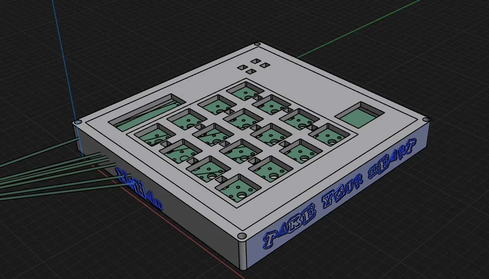
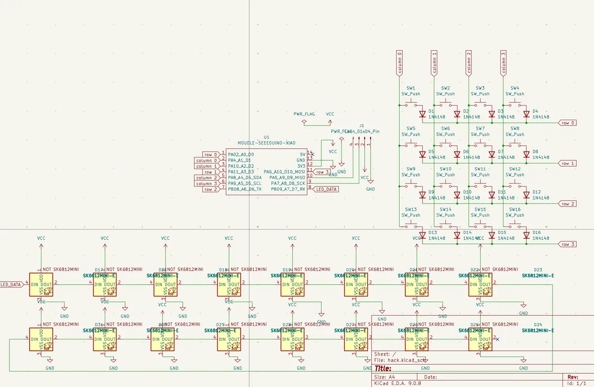
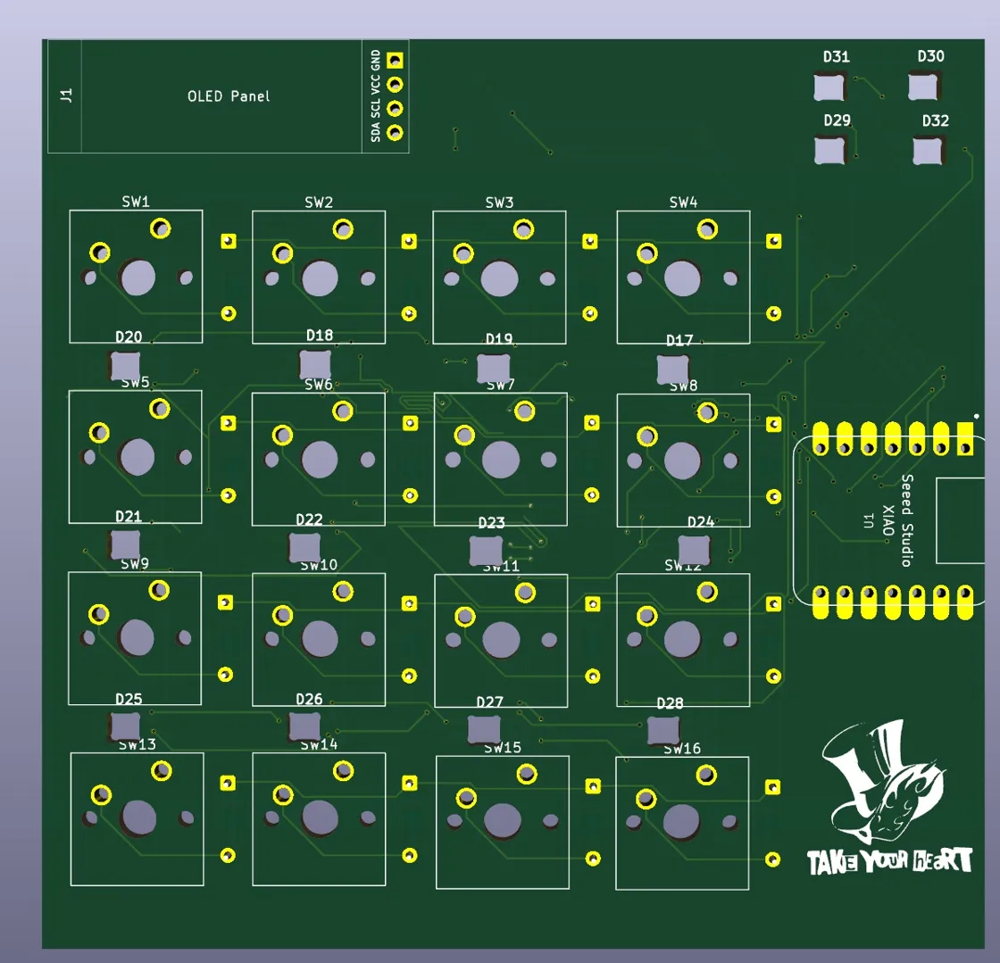

# Natan's Macropad Take Your Heart

A 16-key Persona 5 themed macropad with RGB LEDs, OLED display, and sandwich mount case. Built as part of the Hack Club Blueprint/Hackpad program.

## Features
- 16 keys in a 4×4 matrix
- 32x SK6812MINI-E RGB LEDs between switches
- 0.91" 128x32 OLED display showing Joker silhouette on boot
- Sandwich mount case with engraved "TAKE YOUR HEART" and "Natan" text
- KMK firmware on Seeed XIAO RP2040

## CAD Model
Designed in Shapr3D. Sandwich mount style with a plate on top and case bottom. The plate has switch cutouts, RGB holes, and an OLED window. The case has a USB-C cutout on the side and engraved Persona 5 text on the walls. Held together with 4x M3x16mm screws.

## PCB
Made in KiCad. The silkscreen features the Phantom Thieves logo and "TAKE YOUR HEART" text imported from an SVG. 2 layer board, 99.3x95.9mm.

### Schematic

### PCB

## Firmware Overview
This macropad uses KMK firmware running on CircuitPython.

- 16 keys mapped to productivity shortcuts and mouse controls
- RGB LEDs with rainbow effect
- OLED displays a Joker silhouette on boot

### Keymap
| Position | Action |
|----------|--------|
| 1 | Sleep |
| 2 | Undo |
| 3 | Find |
| 4 | Mute |
| 5 | Copy |
| 6 | Paste |
| 7 | Select All |
| 8 | F3 |
| 9 | Mouse Wheel Up |
| 10 | Right Click |
| 11 | Up Arrow |
| 12 | F5 |
| 13 | Mouse Wheel Down |
| 14 | Left Arrow |
| 15 | Down Arrow |
| 16 | Right Arrow |

## BOM
Here's everything you need to build this macropad:

- 16x Cherry MX Switches
- 32x SK6812MINI-E RGB LEDs
- 16x 1N4148 Diodes
- 1x 0.91" 128x32 OLED Display
- 1x Seeed XIAO RP2040
- 4x M3x16mm Screws
- 1x PCB (2 layer, 99.3x95.9mm)
- 1x 3D Printed Case (plate + bottom)

## Extra Stuff
Persona 5 is one of my favourite games so I had to make a macropad themed around it. The Phantom Thieves logo on the PCB silkscreen came out way better than I expected. Can't wait to build it!

*Made by Natan Hack Club Blueprint 2026*
